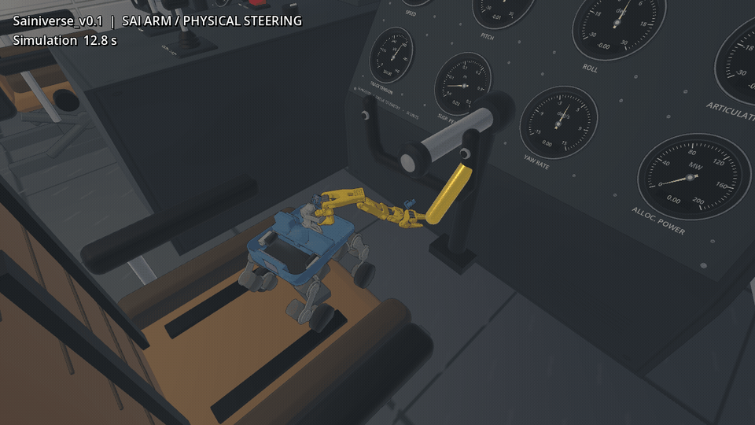
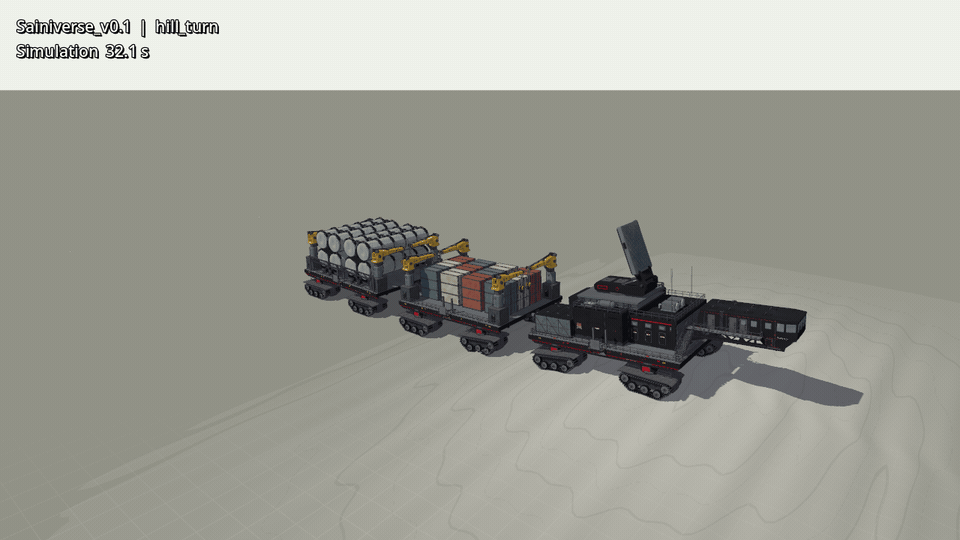
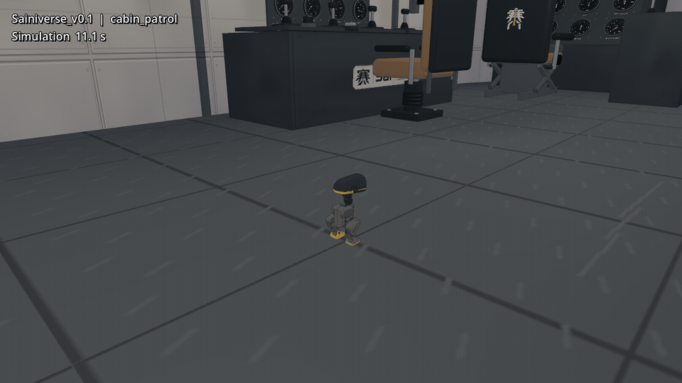
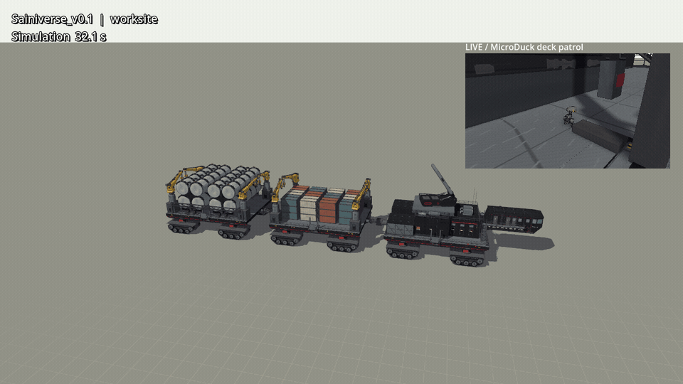
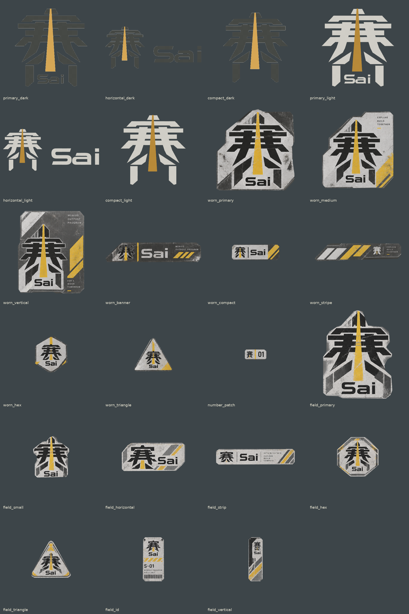
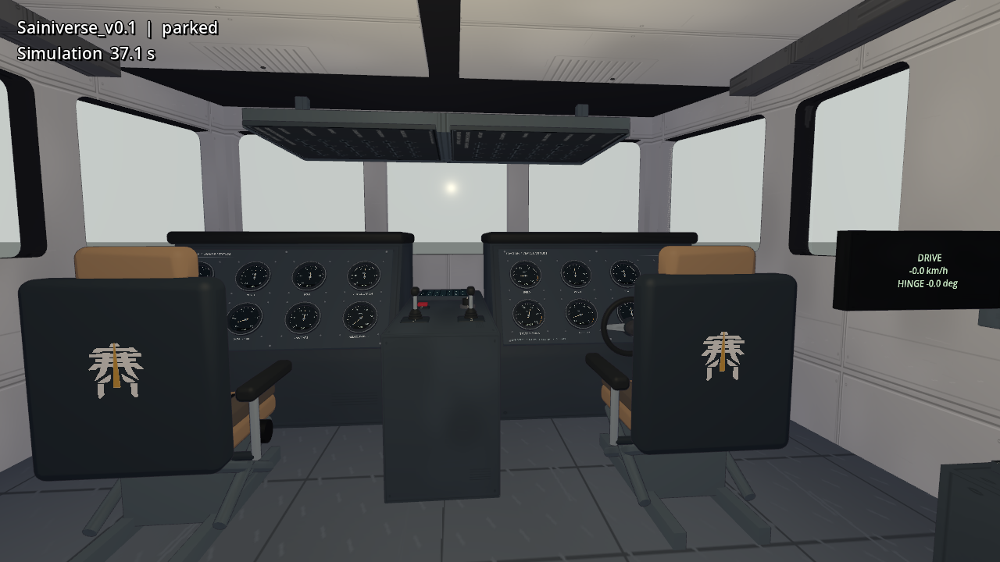

# Sainiverse_v0.1

私有设计审阅版：可编辑车体、五套主题、MuJoCo 模型和 Godot/Jolt 可驾驶版本。沿用现有 Robot_Godot_Sim2Sim 工程，英文显示名统一为 **Sainiverse_v0.1**。

## 极地游戏场景 · 2026-09-20

以下 GIF 均从交付的 Godot/Jolt 极地雪原场景录制，使用实际机器人关节、升降台和驾驶舱碰撞。镜头在舱内和升降平台内部，避开座椅、柜体与护板遮挡。登船片段按阶段选帧，升降过程做了时间压缩；画面没有插帧或合成机器人动作。

**Sai 001 乘升降台登船**


**Sai 001 用机械臂操作驾驶舱方向舵**



这个短片使用已有 Sai 机械臂阻抗控制和脚本指定的末端目标。黄色短柄固定在原有方向舵刚体上；记录验证机械手实际接触它、方向舵关节转动。它不是训练出的自主驾驶舱操作策略。

**普通 MicroDuck 在驾驶舱巡视**


统一游戏入口选择“03 · 极地雪原”再选择“Sainiverse v0.1”即可进入；原有 001 仍在同一车型选择框。四种机器人切换、登船路线、帧率和镜头验证见[验证记录](docs/VALIDATION.md#polar-game-integration-2026-09-20)。

## r032 实际仿真演示

以下均来自实际物理仿真。每段约 10 秒；画面标注原始仿真时间。

**起伏丘陵：直行、上坡、转弯与下坡**



**Sai：从地面经坡板登上升降台，再驶入甲板**


完整登车流程约 100 秒；这段选取坡板、登台、升降和离台四个阶段。为匹配 Sai 的 2 kHz 控制，车体先动态静置 10 秒，再作为固定支承；升降台、坡板和机器人仍参与实际受力与碰撞。另有完整动态车体的 500 kg 升降测试。

**驾驶舱近景：仪表、实体操纵机构与室内材质**


**MicroDuck 行走模式：驾驶舱巡视（r032 重新录制）**



**驻车作业：八台吊机、天线板与轮滑 MicroDuck**



角落近景与全景来自同一时刻、同一物理世界。吊机演示为空载机构动作；尚未完成外部货物的起吊载荷验证。

## 打开可驾驶版本

需要现有 **Robot_Godot_Sim2Sim** checkout、Godot 4.7 / Jolt。附带原生扩展适用于 **Linux ARM64**；其他平台需重建扩展。机器人使用已有 ONNX 策略，车辆采用有限力控制器；任务调度不是新训练出的端到端策略。

```bash
python3 -m venv .venv
.venv/bin/pip install -r requirements.txt
.venv/bin/python run.py --game /absolute/path/to/Robot_Godot_Sim2Sim/main
```

Godot 不在 PATH 时设置 `GODOT_BIN`。首次启动会将演示所需机器人资源装入现有工程的 review runtime，并进行导入；不会创建新的游戏项目。展开后的绝对路径放在忽略的 `.runtime/` 目录。

- W/S 驾驶，A/D 转向，Shift+W 请求高速，空格制动。
- 极地场景停车后按 F5/F6/F7/F8，在车旁雪地切换普通 MicroDuck、轮滑版、Sai 001、Sai 002；F9 返回母车。机器人沿用 W/S、A/D，右键与滚轮可调整跟随视角。时间流速滑条默认 1.0×，可选 0.1×～3.0×。Sai 002 模型从 `SAI_ROBOTS_ROOT` 指向的 Sai_Rotbots 检出目录读取，默认使用 `/home/ethan/Projects/RobotDesign/delivery/Sai_Rotbots`。
- 交互驾驶使用 60 Hz。演示的停车准备阶段分别使用 MicroDuck 60 Hz、Sai 100 Hz；机器人出生后恢复 MicroDuck 200 Hz、Sai 1000 Hz，策略运行 50 Hz。完整路线与帧率数据见[验证记录](docs/VALIDATION.md#polar-game-integration-2026-09-20)。
- Tab 切换视角；右键环视、滚轮缩放；自由视角 WASD、Q/E。
- G 选择升降台，L 升降，Shift+L 全部；升降台和作业机构未收妥时禁止行驶。
- C 作业/收起，N 选择吊机；小键盘 4/6 回转、8/2 俯仰、+/− 伸缩；PageUp/PageDown 卷扬。
- Z/X 天线回转，R/F 折叠；O 舱门；T 切换黑色/沙漠/白色/蓝色/黄色；F12 截图。

```bash
# 手动崎岖地形试车
.venv/bin/python run.py --game /path/to/main --terrain hills
# 复现母车及机器人任务
.venv/bin/python run.py --game /path/to/main --mode hill_turn --terrain hills --seconds 55
.venv/bin/python run.py --game /path/to/main --mode sai_board --seconds 115
.venv/bin/python run.py --game /path/to/main --mode sai_board_002 --seconds 115
.venv/bin/python run.py --game /path/to/main --mode cabin_patrol --seconds 24
.venv/bin/python run.py --game /path/to/main --mode deck_patrol --seconds 24
.venv/bin/python run.py --game /path/to/main --mode worksite --seconds 43
# MuJoCo 机构检查与解压 Blender 源文件
.venv/bin/python run.py --action mujoco
.venv/bin/python run.py --action equipment-mujoco
.venv/bin/python run.py --action cockpit-mujoco
.venv/bin/python run.py --action unpack-blend
```

## 本次室内与结构修正（r032）

驾驶舱、休息区和连接通道补入分区内衬：墙面板缝、检修盖、顶棚通风面板、柜体接缝和钢甲板各自使用对应纹理。贴图按实际尺寸投射，修正板缝扭曲和比例拉伸；座椅软包、硬支架与车体主色分开搭配。

从提供的三张公司素材板裁出 **23 款透明 Sai 贴纸**，在室内外安排 **38 处**标识，包括座椅背板、工程控制台、休息区、车身侧面和吊机底座。原始图、独立 PNG、图集、裁剪脚本和安装坐标均保留，详见 [公司标识说明](vehicles/Sainiverse_v0.1/docs/COMPANY_IDENTITY.md)。





方向盘改为连续圆环，仪表与控制台的穿插已修正。17 个实体控制件对应驾驶、制动、吊机、天线、升降台和舱门操作；仪表读取运行数据。它们保留机械手接触面与操作坐标，但尚未训练 SaiRobot 驾驶舱操作策略。

驾驶舱与休息区通过室内楼梯连接；升降机构补齐固定导轨、重叠滑轨、滚轮和液压外观结构，甲板衔接去除重叠共面。底盘补入有分工的纵向桁架、传动、配电和管路。平台侧面保留主题色，步行面使用灰色钢甲板。

可编辑 Blender、命名刚体 GLB、贴图生成源与 MJCF 在 [`vehicles/Sainiverse_v0.1/`](vehicles/Sainiverse_v0.1/)。机器人运行依赖及来源记录在 [`integration/robots/`](integration/robots/)。测量条件、性能、功能边界和具体证据见 [验证记录](docs/VALIDATION.md)。

驾驶舱美术仍作为审阅版本提交，不将自动测试通过等同于达到《微软模拟飞行》的主观精细度标准。

这是仿真设计审阅版。质量、壁厚、液压能力和强度仍为工程假设；已运行的测试不等同于实体制造认证。第三方素材与机器人模型保留各自来源和许可，详见 [运行依赖说明](integration/robots/licenses/README.md)。
