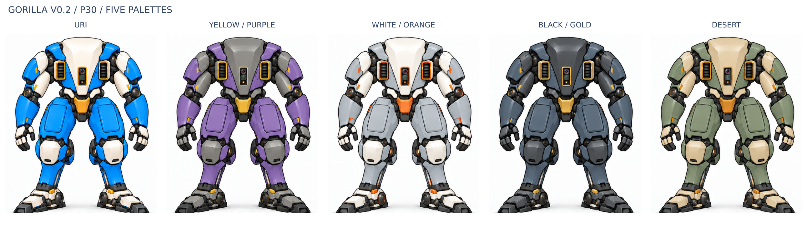
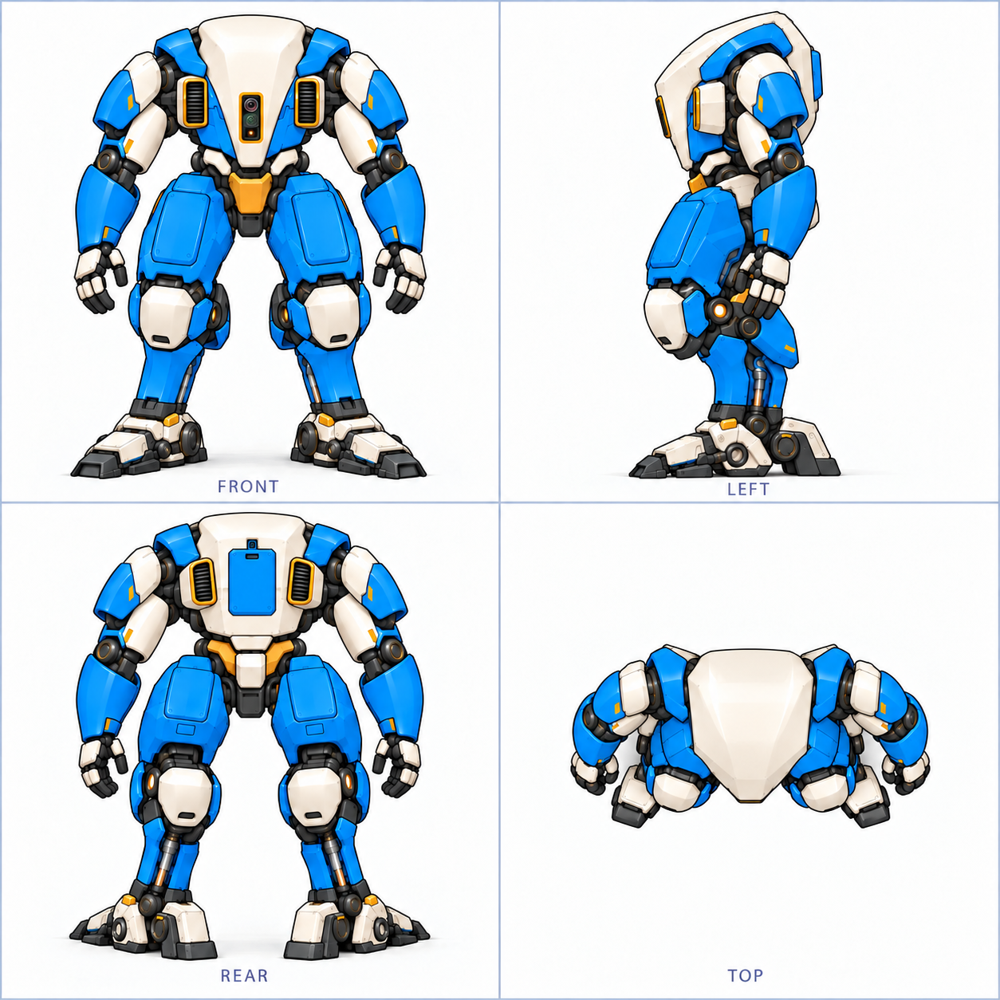

# Sai Art

Sai 的角色、机器人与载具设定集、配色和可编辑 3D 资产。

## Gorilla · V0.2

**[打开 Gorilla 设定集](robots/gorilla/README.md)** · [五款完整四视图](robots/gorilla/artbook.md) · [3D 资产与整包下载](robots/gorilla/README.md#3d-资产与交付包) · [历史迭代](robots/gorilla/history.md)

当前外观定稿为 **P30**，包含 URI、黄紫、白橙、黑金、沙漠五款配色；3D 交付为用户选定的 **B7 腿部 Blender／GLB**。





## 其他项目

| 项目 | 入口 | 内容 |
| --- | --- | --- |
| Sainiverse V0.1 | [载具资料与演示](vehicles/Sainiverse_v0.1/README.md) | 五套主题、制作源、既有驾驶与仿真交付 |
| URI 风格 | [制作参考](docs/uri_style/README.md) | 固定风格图、提示词与项目导航 |

## 目录

```text
robots/gorilla/                 Gorilla 设定集入口
  artbook.md                   当前五款完整四视图
  v0_2_p30/                    冻结交付的便携浏览副本
    themes/                    配色、四视图与总览
    model/                     B7 Blender、GLB、预览与检查记录
    provenance/                提示词、风格参考与制作记录
  history.md                   V0.1／V0.2 历史迭代入口
vehicles/Sainiverse_v0.1/       Sainiverse 制作与旧交付
docs/uri_style/gorilla_v0_*/    Gorilla 原始制作源与完整迭代记录
```

模型和交付压缩包使用 Git LFS；需要本地完整资产时：

```bash
git lfs install
git clone git@github.com:sgyli7/Sai_Art.git
cd Sai_Art
git lfs pull
```

维护前阅读 [资产规则](art_engineering_rules.md)、[目录导航](docs/repository_layout.md) 和 [来源清单](docs/directory_inventory.json)。
