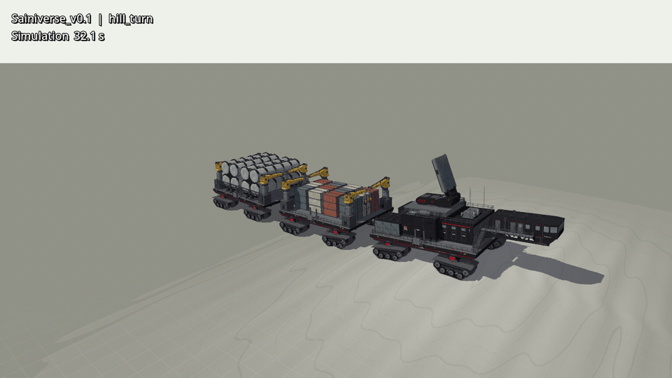

# Sai Art

Sai 的角色、机器人与载具资产库。首页汇总各项目的设定、制作源与演示，完整资料在各自项目目录维护。

## 项目总览

| 项目 | 设定与演示 | 制作与交付 |
| --- | --- | --- |
| **Sainiverse V0.1** | [载具资料与完整仿真演示](vehicles/Sainiverse_v0.1/README.md) | [制作源](vehicles/Sainiverse_v0.1/source/) · [导出资产](vehicles/Sainiverse_v0.1/assets/) · [五套主题](vehicles/Sainiverse_v0.1/themes/) |
| **Gorilla V0.2** | [设定集](robots/gorilla/README.md) · [五款四视图](robots/gorilla/artbook.md) | [B7 3D 与交付包](robots/gorilla/README.md#3d-资产与交付包) · [制作历史](robots/gorilla/history.md) |

## Sainiverse · V0.1

可编辑车体、五套主题、MuJoCo 模型和 Godot/Jolt 可驾驶设计审阅版。车体、驾驶舱、升降台与甲板作业机构的制作源集中在 [`vehicles/Sainiverse_v0.1/`](vehicles/Sainiverse_v0.1/)。

**起伏丘陵：直行、上坡、转弯与下坡**



**驾驶舱：仪表、实体操纵机构与室内材质**


**极地场景：Sai 001 从雪地经升降台登船**


这些片段来自实际仿真。完整流程、控制方式和具体验证边界见 [Sainiverse 项目页](vehicles/Sainiverse_v0.1/README.md) 与 [验证记录](docs/VALIDATION.md)。

| 更多演示 | 入口 |
| --- | --- |
| Sai 经坡板与升降台登上甲板 | [登船片段](evidence/media/Sainiverse_v0.1_sai_boarding.gif) |
| Sai 接触原有驾驶舱控制器 | [控制器接触片段](evidence/media/Sainiverse_v0.1_polar_sai_cockpit_control.gif) |
| MicroDuck 驾驶舱巡视 | [室内巡视](evidence/media/Sainiverse_v0.1_cabin_patrol.gif) · [极地场景巡视](evidence/media/Sainiverse_v0.1_polar_microduck_cockpit.gif) |
| 吊机、天线板与甲板作业 | [作业片段](evidence/media/Sainiverse_v0.1_worksite.gif) |

[打开可驾驶版本与操作说明](vehicles/Sainiverse_v0.1/README.md#打开可驾驶版本) · [公司贴纸与室内标识](vehicles/Sainiverse_v0.1/docs/COMPANY_IDENTITY.md) · [机器人依赖与许可](integration/robots/licenses/README.md)

## Gorilla · V0.2

当前外观定稿为 **P30**，包含 URI、黄紫、白橙、黑金、沙漠五款配色。3D 交付为用户选定的 **B7 腿部 Blender／GLB**。


[打开设定集](robots/gorilla/README.md) · [完整 FRONT／LEFT／REAR／TOP](robots/gorilla/artbook.md) · [3D 与整包下载](robots/gorilla/README.md#3d-资产与交付包) · [历史迭代](robots/gorilla/history.md)


## 仓库目录

```text
vehicles/Sainiverse_v0.1/       Sainiverse 项目
  README.md                    完整演示、打开方式与操作说明
  source/                      可编辑制作源
  assets/                      导出资产
  themes/                      五套主题
  docs/                        项目资料
robots/gorilla/                Gorilla 项目
  README.md                    设定集入口
  artbook.md                   当前五款完整四视图
  v0_2_p30/                    配色、B7 模型、预览与冻结交付资料
  history.md                   历史迭代导航
evidence/                      既有仿真与制作证据
docs/                          维护规则、来源与制作记录
integration/                   既有机器人交付快照与依赖
```

模型和交付压缩包使用 Git LFS；需要本地完整资产时：

```bash
git lfs install
git clone git@github.com:sgyli7/Sai_Art.git
cd Sai_Art
git lfs pull
```

维护前阅读 [资产规则](art_engineering_rules.md)、[目录导航](docs/repository_layout.md) 和 [来源清单](docs/directory_inventory.json)。
