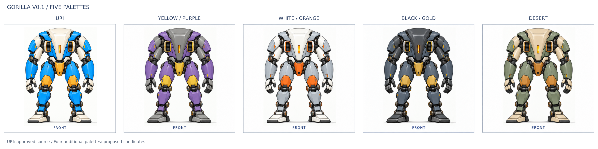

# Gorilla V0.1 五主题配色

保留 URI 原主题，新增黄紫、白橙、黑金、沙漠。四套新增配色是自拟方案：黄紫参考找到的 MicroDuck 历史石墨灰／黄／紫色板，其余三套自行拟定，尚未核实为 MicroDuck 原四主题。

| 主题 | 完整四视图 | 提示词 |
|---|---|---|
| URI | [原稿](../images/locked_four_view_review_rev_aa3.png) | 保持 AA3 原稿不变 |
| 黄紫 | [图稿](images/yellow_purple.png) | [改色提示词](prompts/yellow_purple.txt) |
| 白橙 | [图稿](images/white_orange.png) | [改色提示词](prompts/white_orange.txt) |
| 黑金 | [图稿](images/black_gold_rev_2.png) | [改色提示词](prompts/black_gold.txt)、[顶视边缘修正](prompts/black_gold_rear_edge_fix.txt) |
| 沙漠 | [图稿](images/desert.png) | [改色提示词](prompts/desert.txt) |

下载后打开 [预览页](index.html) 可查看全部图稿。GitHub 上使用本页的图片链接。

新增配色使用内置 imagegen 编辑模式，以同一 AA3 图稿独立改色。四视图构图和主要结构沿用原稿；生成图仍可能有细节差异，不是 CAD 几何保证。URI 原稿 SHA256 为 `5c0469708d7c878ac6253e6ac3e6276198bf3694235bbed3da66c8c743b5aba4`。

[主题目录](theme_catalog.json) 记录配色与图像校验值；[生成记录](generation_manifest.json) 保存本次五次实际调用的提示词、输入和输出校验值，原工作区绝对路径只用于来源追踪。[参考图快照](references) 保存三张 URI 风格输入，均为原图逐字节复制。

[排版制作源](build_theme_preview.py) 将现有图稿嵌入 SVG 并导出对比 PNG，不重绘图像。在具有 Python 3、librsvg、cairo、gobject 的 Linux 环境运行 `python build_theme_preview.py` 可重新生成预览。
