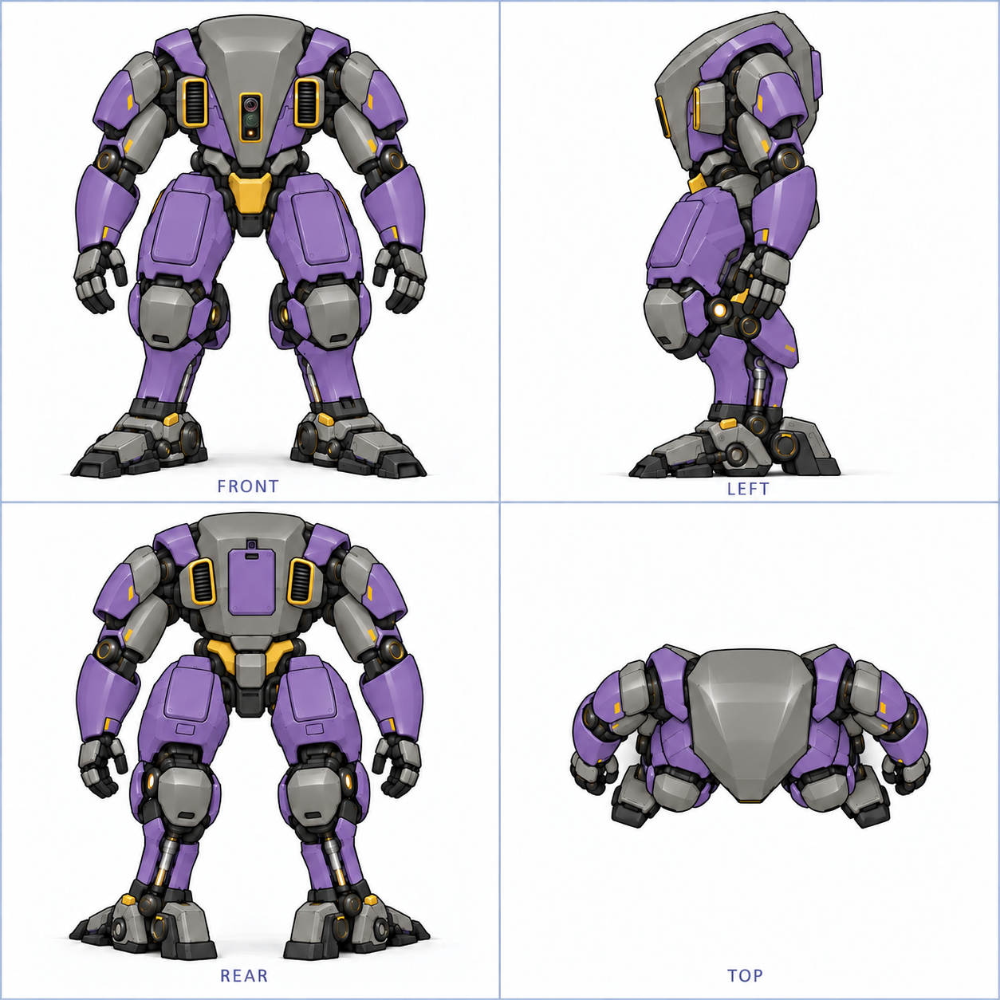
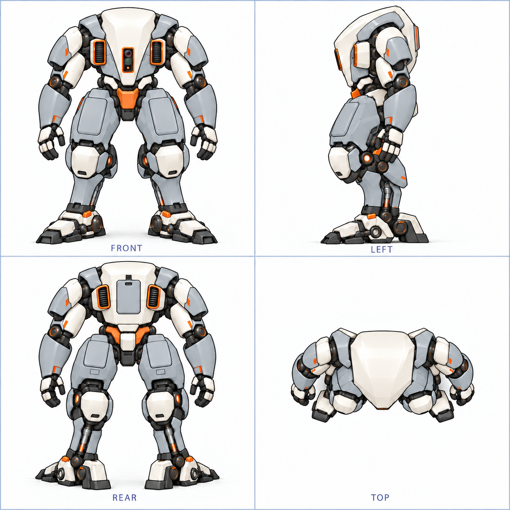
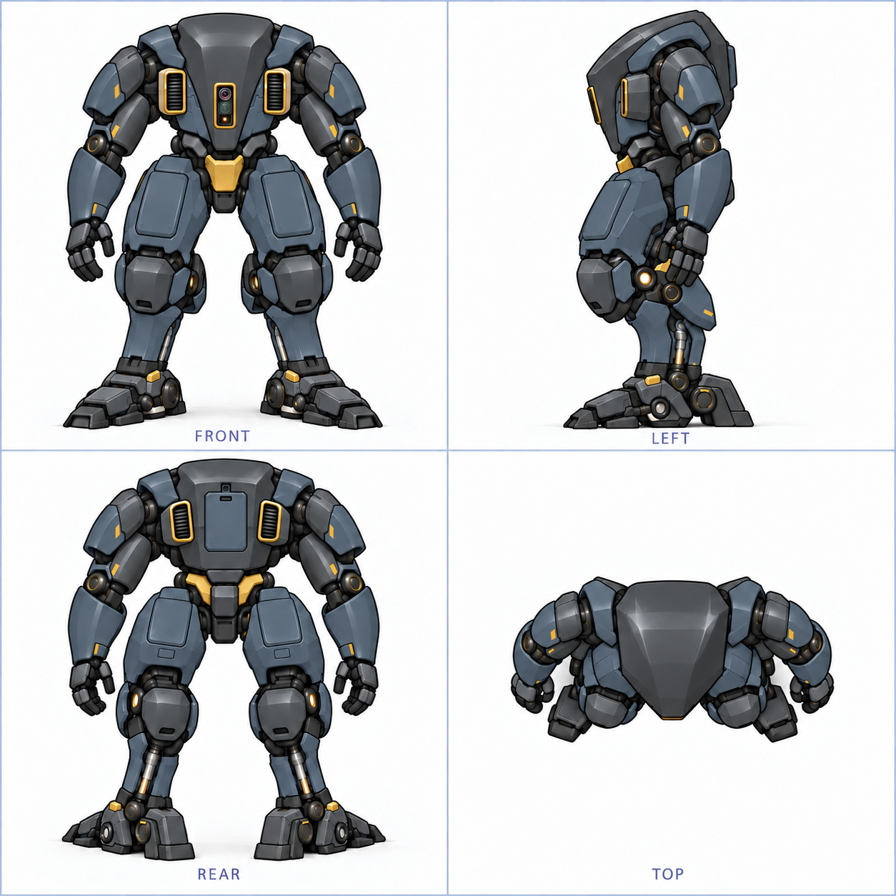
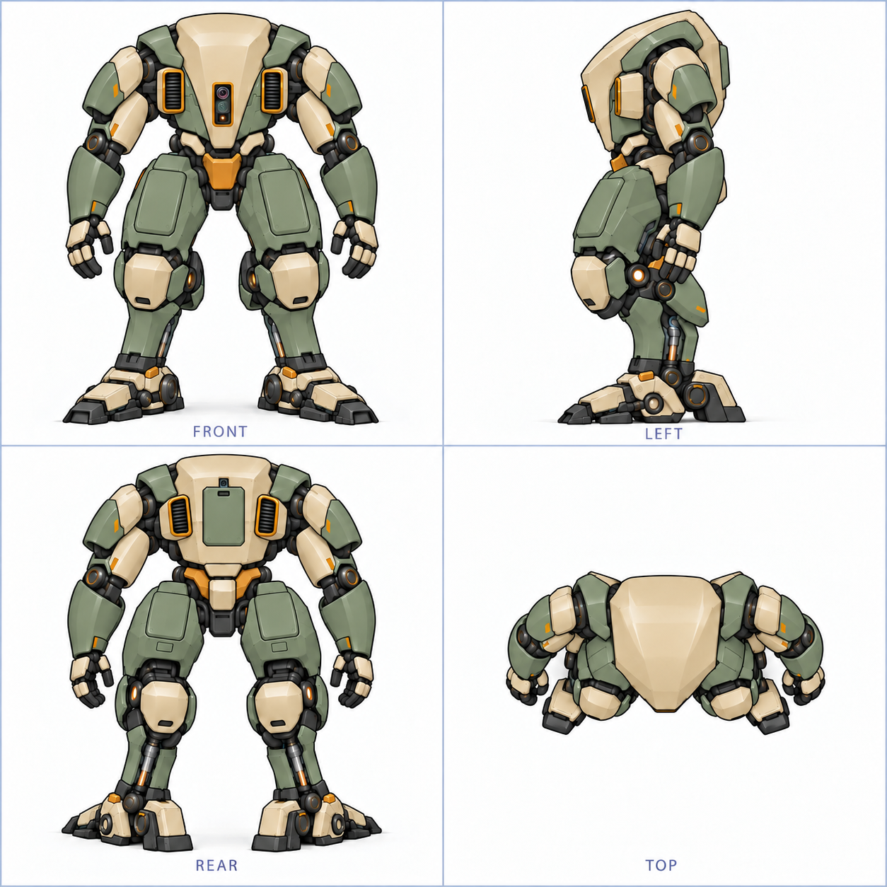
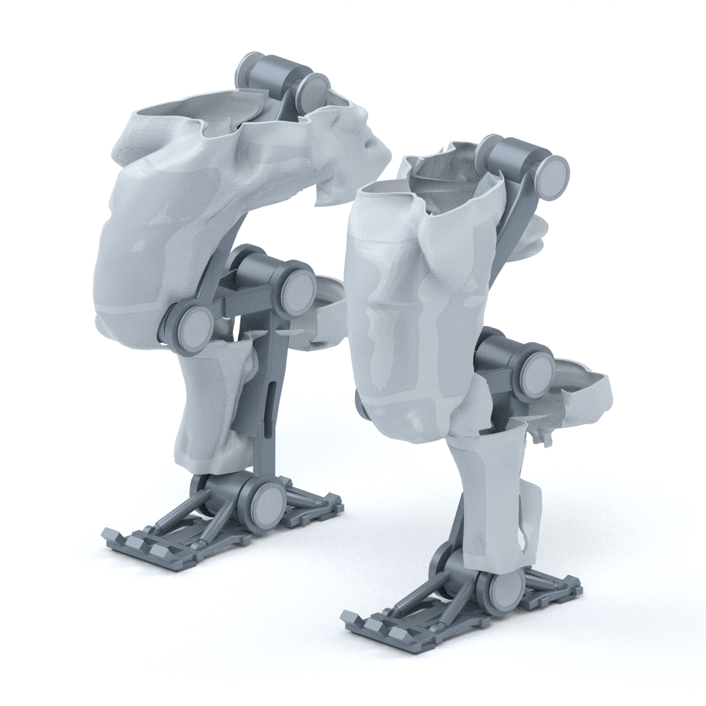
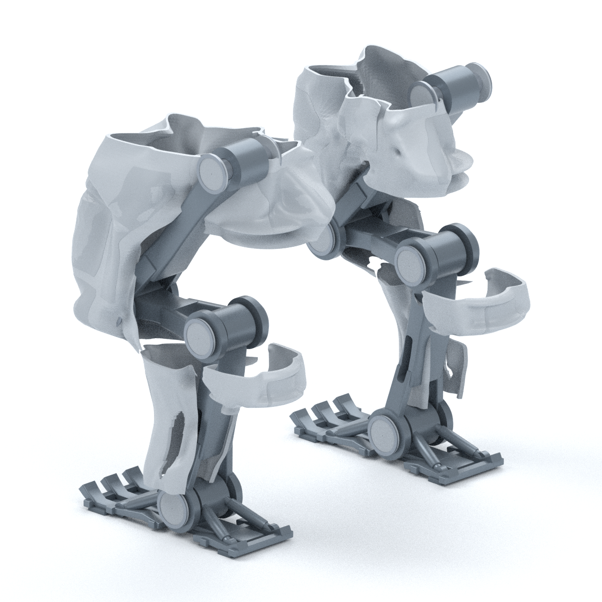

# Gorilla 五款四视图 · P30

[返回设定集](README.md) · [3D 资产与整包下载](README.md#3d-资产与交付包) · [历史迭代](history.md)

所有主题沿用当前 P30 外观，按同一组件角色映射配色。

## URI

[原尺寸 PNG](v0_2_p30/themes/images/uri_p30.png) · [排版 SVG](v0_2_p30/themes/images/uri_p30.svg)

## 黄紫

[原尺寸 PNG](v0_2_p30/themes/images/yellow_purple_p30.png) · [排版 SVG](v0_2_p30/themes/images/yellow_purple_p30.svg)

## 白橙

[原尺寸 PNG](v0_2_p30/themes/images/white_orange_p30.png) · [排版 SVG](v0_2_p30/themes/images/white_orange_p30.svg)

## 黑金

[原尺寸 PNG](v0_2_p30/themes/images/black_gold_p30.png) · [排版 SVG](v0_2_p30/themes/images/black_gold_p30.svg)

## 沙漠

[原尺寸 PNG](v0_2_p30/themes/images/desert_p30.png) · [排版 SVG](v0_2_p30/themes/images/desert_p30.svg)

## B7 原生模型预览

